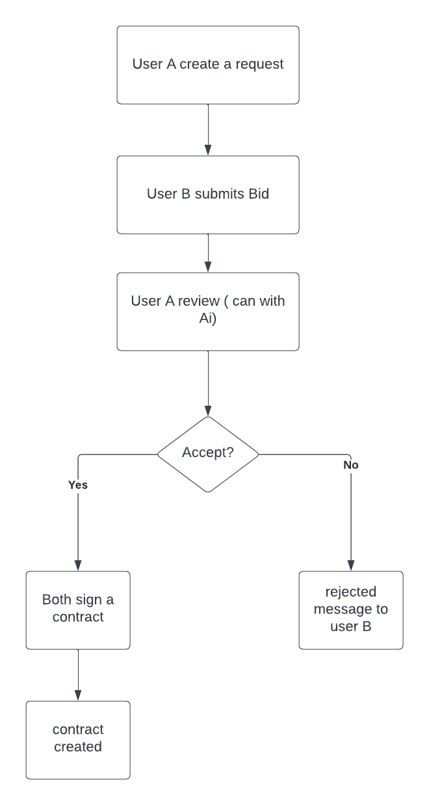
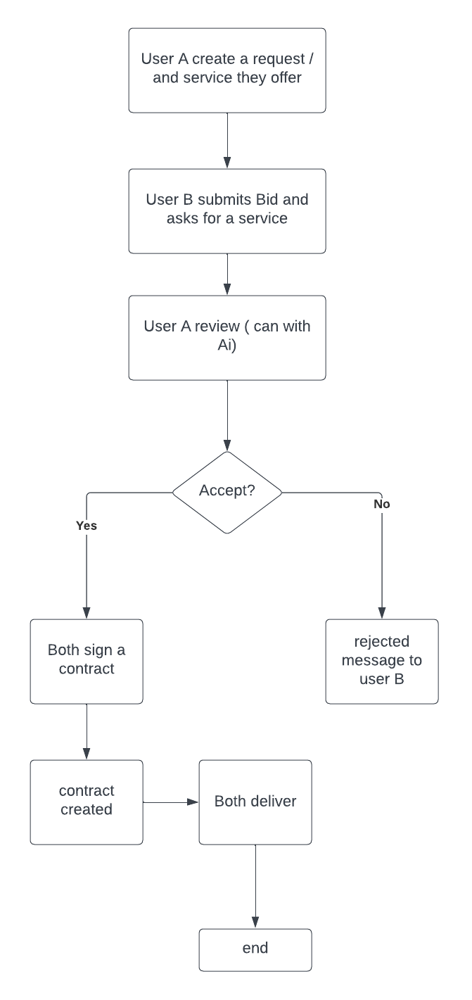
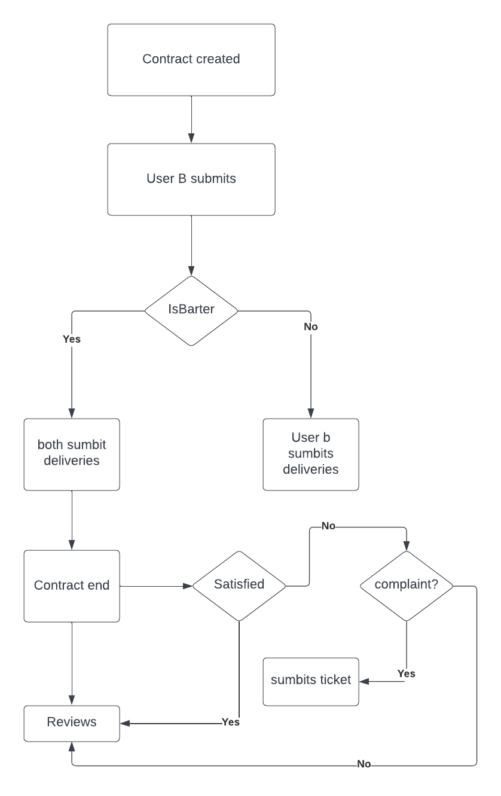
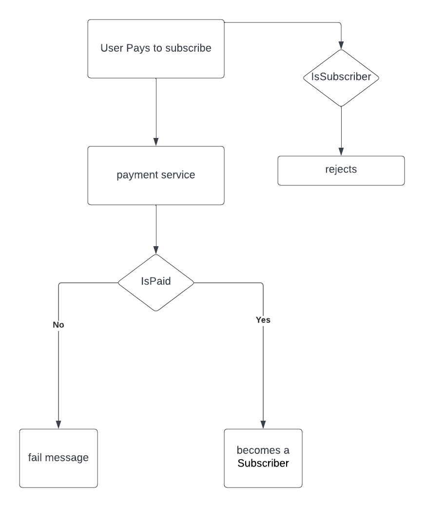
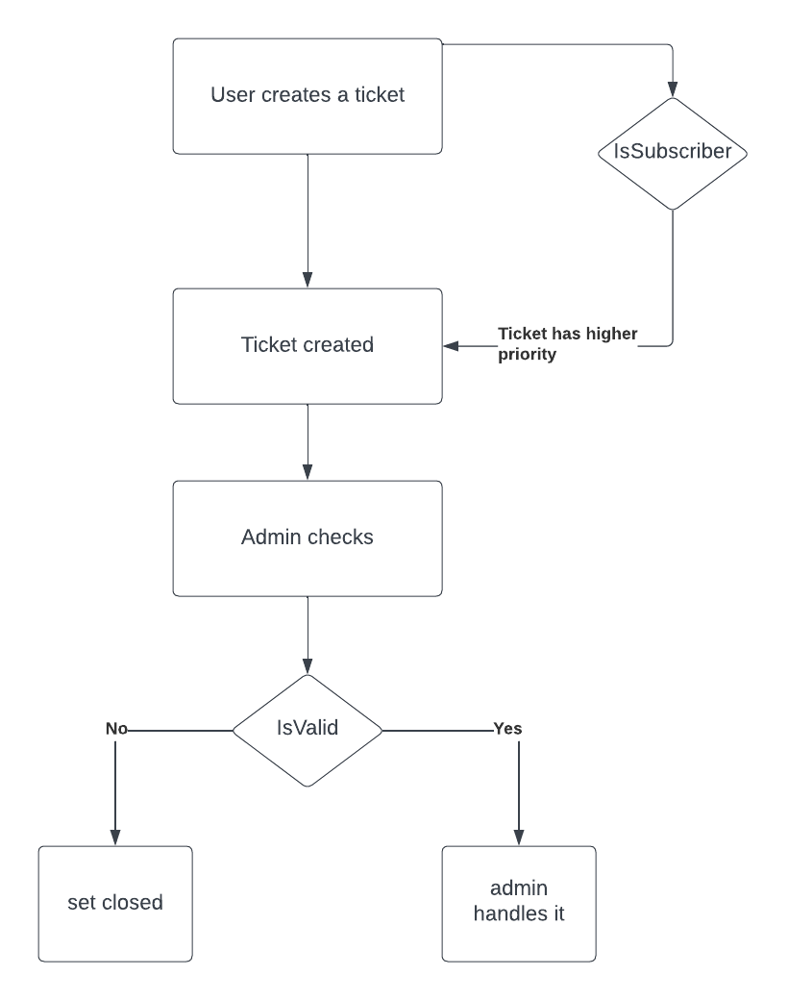
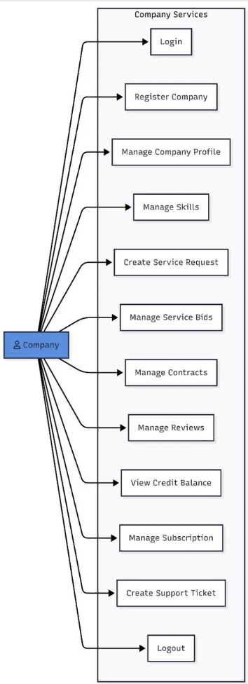
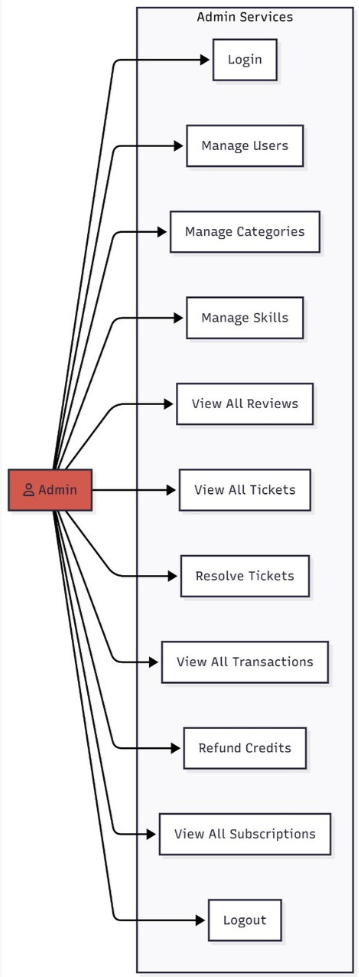

<div align="center">
  
  
  # Manfaa
  ### B2B Service Exchange Platform for Saudi Arabia
  
  [](https://spring.io/projects/spring-boot)
  [](https://www.mysql.com/)
  [](LICENSE)
  
  [Features](#-key-features) • [Architecture](#-architecture) • [API Documentation](#-api-documentation) • [Workflows](#-core-workflows)
</div>

---

## 📋 Table of Contents
- [Introduction](#-introduction)
- [Problem Statement](#-problem-statement)
- [Key Features](#-key-features)
- [User Roles & Permissions](#-user-roles--permissions)
- [Architecture](#-architecture)
- [Core Workflows](#-core-workflows)
- [AI-Powered Features](#-ai-powered-features)
- [API Documentation](#-api-documentation)
- [Tech Stack](#-tech-stack)
- [Getting Started](#-getting-started)
- [Contributing](#-contributing)

---

## 🎯 Introduction

**Manfaa** is a comprehensive B2B service exchange platform designed specifically for the Saudi Arabian market. It enables small businesses and startups to trade professional services using a dual-currency system: **time-based tokens** and **direct service bartering**.

Early-stage companies often need essential services—legal support, accounting, marketing, design, or IT consulting—but limited cash flow makes traditional payments challenging. Meanwhile, these same businesses possess valuable skills and expertise that others need.

Manfaa creates a structured, trusted marketplace where businesses can:
- 💱 Exchange services using tokens or direct barter
- 🔒 Secure transactions with smart escrow systems
- ✅ Manage contracts with bilateral approval
- ⭐ Build reputation through transparent reviews
- 🤖 Leverage AI to find optimal service matches

---

## ❓ Problem Statement

Small businesses face three critical challenges when accessing professional services:

| Challenge | Impact |
|-----------|--------|
| **Limited Cash Flow** | Especially acute in early growth stages |
| **Lack of Trust** | No structured bartering systems exist |
| **High Platform Costs** | Traditional marketplaces require upfront cash |

**Informal service exchanges** lack accountability, tracking, and trust mechanisms. **Paid platforms** create cash barriers for bootstrapped startups.

**Manfaa bridges this gap** by providing a formal service exchange ecosystem backed by tokens, smart contracts, reputation systems, and AI-powered matching.

---

## ✨ Key Features

### 🏢 For Companies

#### Service Discovery & Requests
- Create service requests with flexible payment options (Token/Barter/Either)
- Browse and filter services by category, budget, timeline, and exchange type
- Advanced search with keyword matching
- Sort by token amount (ascending/descending)
- Priority visibility for subscribers

#### Smart Bidding System
- Submit competitive bids with custom pricing and timelines
- Update or withdraw pending bids
- Receive instant email notifications on bid decisions
- AI-powered bid ranking and optimization

#### Secure Contract Management
- **Bilateral approval** required from both parties
- **Token escrow system** ensures payment security
- Track contract lifecycle: `PENDING → ACTIVE → COMPLETED`
- Mark deliverables as complete with proof
- One-time contract extension (50% of original duration)
- Dispute resolution through support tickets

#### Transparent Review System
- Rate completed contracts (1-5 stars with decimal precision)
- Write detailed review descriptions (minimum 10 characters)
- Search reviews by keyword
- Filter by exchange type
- Sort by rating (best to worst)
- Build trust and reputation

#### Token Economy
- View real-time token balance, earnings, and spending
- Complete transaction history
- Secure token purchases via payment gateway
- Automatic escrow management

#### Premium Subscriptions
- **Monthly Plan**: 120 SAR
- **Yearly Plan**: 1,200 SAR (17% savings)
- **Benefits**: Priority search ranking, faster support, premium badge
- Cancel anytime (active until period end)

#### Support & Assistance
- Multi-category ticketing: Contract/Subscription/Platform/Suggestions
- Auto-priority assignment based on subscription status
- Track resolution status
- Direct admin communication

### 👨‍💼 For Administrators

- Complete user management and oversight
- Category and skill library management (10+ categories, 10+ skills)
- Review monitoring and moderation
- Support ticket resolution
- Credit refund processing
- Transaction oversight
- Subscription management
- Dispute resolution tools

---

## 👥 User Roles & Permissions

### Company Account
- Create and manage company profile
- Build skills portfolio
- Create/browse service requests
- Submit and manage bids
- Execute contracts
- Write and receive reviews
- Purchase tokens
- Subscribe to premium features
- Create support tickets

### Admin Account
- Full platform oversight
- User and company management
- Category/skill administration
- Ticket resolution
- Credit operations
- Transaction monitoring
- System analytics

---

## 🏗 Architecture

### Database Schema
```
Users ──┬── CompanyProfiles ──┬── Skills (M2M)
        │                     ├── ServiceRequests ──┬── ServiceBids
        │                     ├── Contracts          │
        │                     ├── Reviews            │
        │                     ├── CompanyCredits     │
        │                     └── SupportTickets     └── CreditTransactions
        │
        └── Categories
```

### Token Escrow System

The platform implements a three-state token lifecycle ensuring transaction integrity:

1. **HOLD**: Tokens locked in escrow when contract is created
2. **TRANSFER**: Tokens moved to provider upon successful completion
3. **RELEASE**: Tokens returned to requester if contract is cancelled

```
Requester Balance → [ESCROW] → Provider Balance
                  ↓
            (if cancelled)
                  ↓
          Requester Balance
```

### Contract Lifecycle

```
PENDING (awaiting bilateral approval)
   ↓
ACTIVE (work in progress, can extend once)
   ↓
COMPLETED (tokens transferred, reviews enabled)
   
OR

CANCELLED (tokens refunded)
   
OR

DISPUTED (support ticket, admin resolution)
```

---

## 🔄 Core Workflows
### ERD

### Token-Based Request Flow


*Token requests involve escrow, secure payment, and automated transfers upon completion*

### Barter Request Flow


*Direct service-for-service exchanges with mutual agreement tracking*

### Contract Management Flow


*Bilateral approval, milestone tracking, and completion verification*

### Subscription Flow


*Flexible monthly/yearly plans with instant premium benefits*

### Support Ticket Flow


*Priority-based support with automatic categorization*

---

## 🤖 AI-Powered Features

Manfaa integrates advanced AI capabilities to enhance user experience and decision-making:

### 1. RAG-Based Platform Assistant
**Endpoint**: `POST /api/v1/ai/ask-rag`

An intelligent chatbot powered by Retrieval-Augmented Generation (RAG) that answers questions about:
- Platform features and capabilities
- How to use specific functions
- Best practices for service exchanges
- Troubleshooting common issues

### 2. Intelligent Bid Ranking
**Endpoint**: `POST /api/v1/ai/rank-bids`

AI-powered analysis that evaluates all bids for a service request and provides:
- Comprehensive ranking based on multiple factors
- Best value recommendations
- Risk assessments
- Suggested optimal choices

### 3. Smart Time Estimation
**Endpoint**: `POST /api/v1/ai/suggest-hours`

Helps users create realistic requests and bids by:
- Analyzing service requirements
- Suggesting appropriate hour estimates
- Identifying necessary skills and resources
- Providing industry-standard benchmarks

These AI features leverage machine learning to make the platform more intuitive, reduce friction in service exchanges, and help users make informed decisions.

---

## 📚 API Documentation

### User Endpoints


### Admin Endpoints


### My Contributions

I developed the following core systems and endpoints:

#### Authentication & Session Management
| Method | Endpoint | Description |
|--------|----------|-------------|
| `POST` | `/api/v1/auth/login` | User authentication with JWT token generation |
| `POST` | `/api/v1/auth/logout` | Session termination with cookie clearing |

#### Service Request Management (10 endpoints)
| Method | Endpoint | Description |
|--------|----------|-------------|
| `GET` | `/api/v1/service-request/get-requests` | Retrieve all service requests |
| `GET` | `/api/v1/service-request/get-requests-subscriber` | Get prioritized requests for subscribers |
| `POST` | `/api/v1/service-request/create-token-request` | Create token-based service request |
| `PUT` | `/api/v1/service-request/update/{requestId}` | Update existing request details |
| `DELETE` | `/api/v1/service-request/delete/{requestId}` | Remove service request |
| `GET` | `/api/v1/service-request/get-with-bids/{requestId}` | Get request with all submitted bids |
| `GET` | `/api/v1/service-request/get-with-bids-subscribers/{requestId}` | Get request with bids (subscriber view) |
| `GET` | `/api/v1/service-request/get-all-with-bids` | Retrieve all requests with their bids |
| `GET` | `/api/v1/service-request/get-company-requests/{companyId}` | Get all requests from specific company |
| `GET` | `/api/v1/service-request/get-company-open/{companyId}` | Get open requests from company |
| `GET` | `/api/v1/service-request/get-company-closed` | Get closed requests for authenticated company |
| `GET` | `/api/v1/service-request/get-company-cancelled` | Get cancelled requests for authenticated company |

#### Bidding System (6 endpoints)
| Method | Endpoint | Description |
|--------|----------|-------------|
| `GET` | `/api/v1/service-bid/get-all` | Retrieve all bids (Admin only) |
| `POST` | `/api/v1/service-bid/create/{requestId}` | Submit competitive bid |
| `PUT` | `/api/v1/service-bid/update/{bidId}` | Update bid details |
| `DELETE` | `/api/v1/service-bid/delete/{bidId}` | Withdraw/delete bid |
| `PUT` | `/api/v1/service-bid/accept/{bidId}` | Accept bid and create contract |
| `PUT` | `/api/v1/service-bid/reject/{bidId}` | Reject bid with notes |

#### Contract Management (6 endpoints)
| Method | Endpoint | Description |
|--------|----------|-------------|
| `GET` | `/api/v1/contract/get-all` | View all contracts (Admin only) |
| `POST` | `/api/v1/contract/create` | Create contract from accepted bid |
| `PUT` | `/api/v1/contract/accept/{contractId}` | Provider accepts contract |
| `PUT` | `/api/v1/contract/reject/{contractId}` | Reject contract proposal |
| `PUT` | `/api/v1/contract/complete/{contractId}` | Mark contract delivery complete |
| `DELETE` | `/api/v1/contract/delete/{contractId}` | Delete pending contract (Admin) |

#### Skills Management (2 endpoints)
| Method | Endpoint | Description |
|--------|----------|-------------|
| `GET` | `/api/v1/skills/get-skills` | Get authenticated company's skills |
| `PUT` | `/api/v1/skills/assign-skill/{skillId}` | Assign skill to company portfolio |
| `PUT` | `/api/v1/skills/remove-skill/{skillId}` | Remove skill from company |

#### Support Ticket System (8 endpoints)
| Method | Endpoint | Description |
|--------|----------|-------------|
| `POST` | `/api/v1/ticket/add-contract/{contractId}` | Create contract-related ticket |
| `POST` | `/api/v1/ticket/add-suggestion` | Submit feature suggestion |
| `POST` | `/api/v1/ticket/add-subscription` | Create subscription support ticket |
| `POST` | `/api/v1/ticket/add-platform` | Report platform/technical issue |
| `PUT` | `/api/v1/ticket/resolve` | Resolve ticket (Admin) |
| `PUT` | `/api/v1/ticket/reject` | Reject ticket (Admin) |
| `GET` | `/api/v1/ticket/subscriber/{isSubscriber}` | Filter tickets by subscriber status |
| `GET` | `/api/v1/ticket/subscriber/{isSubscriber}/category/{category}` | Filter by subscriber and category |
| `GET` | `/api/v1/ticket/subscriber/{isSubscriber}/priority/{priority}` | Filter by subscriber and priority |
| `GET` | `/api/v1/ticket/subscriber/{isSubscriber}/category/{category}/priority/{priority}` | Multi-criteria filtering |

#### Transaction & Credit Management (2 endpoints)
| Method | Endpoint | Description |
|--------|----------|-------------|
| `POST` | `/api/v1/transaction/add-balance` | Add credits to company (Admin) |
| `PUT` | `/api/v1/transaction/refund/{transactionId}` | Process credit refund (Admin) |

#### Payment Gateway Integration (2 endpoints)
| Method | Endpoint | Description |
|--------|----------|-------------|
| `POST` | `/api/v1/payments/pay` | Process payment via gateway |
| `GET` | `/api/v1/payments/callback` | Handle payment gateway webhook |

#### AI-Powered Features (3 endpoints)
| Method | Endpoint | Description |
|--------|----------|-------------|
| `POST` | `/api/v1/ai/ask-rag` | RAG-based platform assistance chatbot |
| `POST` | `/api/v1/ai/rank-bids` | AI-powered bid ranking and recommendations |
| `POST` | `/api/v1/ai/suggest-hours` | Smart time and resource estimation |

### Complete API Documentation
For detailed API specifications, request/response examples, and testing:
- **[Postman Documentation](https://documenter.getpostman.com/view/46904242/2sBXVbJZbv)**
- **[Figma Design System](https://www.figma.com/site/3bPA8IWIxBTUWX803YicFz/Manafaah?node-id=0-1&p=f&t=eFcKHpnWZnGD9ogl-0)**

---

## 🛠 Tech Stack

### Backend
- **Framework**: Spring Boot 3.x
- **Security**: Spring Security + JWT (HTTP-only cookies)
- **ORM**: Hibernate/JPA
- **Database**: MySQL 8.0
- **Build Tool**: Maven

### Authentication & Security
- JSON Web Tokens (JWT)
- BCrypt password encryption
- Role-based authorization (`COMPANY`, `ADMIN`)
- HTTP-only cookie sessions

### Email & Notifications
- JavaMailSender (SMTP)
- Automated notifications for:
  - Bid decisions
  - Contract updates
  - Reviews
  - Refunds
  - Support tickets

### Payment Integration
- Payment gateway ready (Moyasar/Stripe compatible)
- Secure token handling
- Webhook callback processing

### AI & Machine Learning
- RAG (Retrieval-Augmented Generation) for chatbot
- Machine learning for bid ranking
- NLP for time estimation

---

## 🚀 Getting Started

### Prerequisites
- Java 17 or higher
- MySQL 8.0+
- Maven 3.6+

### Installation

1. **Clone the repository**
```bash
git clone https://github.com/yourusername/manfaa.git
cd manfaa
```

2. **Configure database**
```properties
# application.properties
spring.datasource.url=jdbc:mysql://localhost:3306/manfaa
spring.datasource.username=your_username
spring.datasource.password=your_password
```

3. **Configure email (SMTP)**
```properties
spring.mail.host=smtp.gmail.com
spring.mail.port=587
spring.mail.username=your_email@gmail.com
spring.mail.password=your_app_password
```

4. **Build and run**
```bash
mvn clean install
mvn spring-boot:run
```

5. **Access the application**
- API: `http://localhost:8080/api/v1`
- Admin panel: `http://localhost:8080/admin`

### Initial Setup
The system automatically creates:
- 10 predefined categories
- 10+ essential skills
- Default admin account

---

## 🎯 Problems Solved

### 1. **Cash Flow Barriers**
Traditional service marketplaces require upfront payment, creating barriers for bootstrapped startups. Manfaa enables service exchange through tokens and direct barter, preserving cash for critical operations.

### 2. **Trust & Accountability**
Informal service exchanges lack structure and often lead to disputes. Manfaa provides:
- Bilateral contract approval
- Token escrow systems
- Transparent review mechanisms
- Formal dispute resolution

### 3. **Service Discovery**
Finding the right service provider is time-consuming. Manfaa offers:
- Advanced filtering and search
- Subscriber priority visibility
- AI-powered bid recommendations
- Category-based organization

### 4. **Fair Value Exchange**
Determining fair value for service-for-service trades is difficult. Manfaa provides:
- Token-based standardization
- Community-driven pricing through bids
- Historical transaction data
- AI-powered time estimates

### 5. **Transaction Security**
Service exchanges often lack payment protection. Manfaa implements:
- Smart escrow for token transactions
- Milestone-based releases
- Automated refund mechanisms
- Proof of delivery requirements

---

## 🤝 Contributing

We welcome contributions to Manfaa! Here's how you can help:

### Development Process
1. Fork the repository
2. Create a feature branch (`git checkout -b feature/AmazingFeature`)
3. Commit your changes (`git commit -m 'Add some AmazingFeature'`)
4. Push to the branch (`git push origin feature/AmazingFeature`)
5. Open a Pull Request

### Code Standards
- Follow Spring Boot best practices
- Write comprehensive unit tests
- Document all public APIs
- Use meaningful commit messages

### Areas for Contribution
- Additional AI features
- Mobile app integration
- Enhanced analytics
- Multi-language support
- Advanced matching algorithms
- Performance optimizations

---

## 📄 License

This project is licensed under the MIT License - see the [LICENSE](LICENSE) file for details.

<div align="center">
  
### Built with ❤️ for the Saudi Arabian startup ecosystem

**Empowering businesses through collaborative service exchange**

</div>
